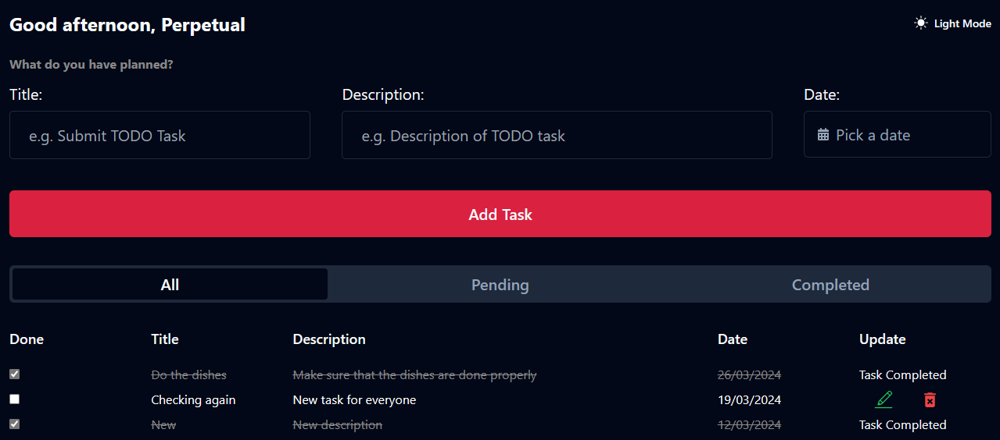

# Take-Home Project For Frontend Development Track 2024

### Project

Develop a task management application that allows users to create, update, and delete tasks. The application should provide a user-friendly
interface for managing tasks effectively.

### Requirements

- Implement functionality to add new tasks with a title, description, and due date.

- Enable users to mark tasks as complete or incomplete.

- Allow users to edit existing tasks and update their details.

- The application should fetch the data from a public API.

- Provide an option to delete tasks from the list.

### User Interface
-   Design a clean and intuitive user interface for the task management application.

-   Use appropriate layout techniques to organize tasks and provide clear navigation options.

-   Ensure ease of use and accessibility for users of all levels.

### Data Persistence:
-   Store task data locally using browser storage mechanisms like localStorage or IndexedDB.
-   Implement data retrieval and manipulation functions to interact with stored task data.

### Validation and Error Handling:
-   Validate user input to ensure data integrity and prevent errors.
-   Handle edge cases gracefully, such as empty inputs or invalid dates.

### Responsive Design:
-   Make the application responsive to different screen sizes and devices.
-   Ensure that the user interface adapts smoothly to mobile, tablet, and desktop environments.

### Interactivity:
-   Add interactive elements to enhance user experience, such as buttons, forms, and feedback messages.
-   Implement smooth transitions and animations to make the application more engaging.

### Version Control and Documentation:
-   Use Git for version control and maintain a well-structured repository.
-   Include clear and concise documentation explaining how to set up and run the application locally.
-   Document any design decisions or trade-offs made during development.

### Additional Guidelines:
-   You can choose to implement the application using vanilla JavaScript or any frontend framework of your choice (e.g., React, Angular,
Vue.js).
-   Focus on code quality, readability, and adherence to best practices.
-   Test the application thoroughly to identify and fix any bugs or issues.

### Sample UI's References:
-   [Task: TODO List App](https://dribbble.com/shots/12099221-Tasx-Todo-List-App)
-   [FIFOdo App](https://dribbble.com/shots/18675079-FIFOdo-app)
-   [Task Management App](https://dribbble.com/shots/19752197-Task-Management-App)

### Technologies Used:
-   [React with Vite](https://vitejs.dev/guide/) - React is a library that is used to build websites based on Reusable Components. Vite is a build tool that aims to provide a faster and leaner development experience for web projects.
-   [TailwindCSS](https://tailwindcss.com/) - A utility-first CSS framework packed with classes that can be composed to build any design, directly in your markup.
-   [Shadcn](https://ui.shadcn.com/docs/installation) - Beautifully designed reusable components that you can copy and paste into your application.

### Browser Storage
- [IndexedDB](https://developer.mozilla.org/en-US/docs/Web/API/IndexedDB_API) - IndexedDB is a low-level API for client-side storage of significant amounts of structured data, including files/blobs. This was used to store the TODO list items.

- [localStorage](https://developer.mozilla.org/en-US/docs/Web/API/Window/localStorage) - localStorage is used to save key/value pairs in the browser. This was used to store the user name.

### Challenges Faced
- The major challenge was trying to integrate IndexedDB as the browser storage I used for the application. I love challenges and I set out to use IndexedDB as opposed to localStorage since I have never used it before and would love the experience. It was an amazing experience overall.
Resources that helped me include:
- [MDN](https://developer.mozilla.org/en-US/docs/Web/API/IndexedDB_API)
- [MDN Example](https://github.com/mdn/dom-examples/tree/main/to-do-notifications)
- [An article on DEV.TO by Chibuike Nwachukwu](https://dev.to/logrocket/a-complete-guide-to-using-indexeddb-5dci)
- [An article on DEV.TO by Alex Eagleson](https://dev.to/alexeagleson/how-to-use-indexeddb-to-store-data-for-your-web-application-in-the-browser-1o90)

### Demo:

Deployed using Vercel:
[Uptick TODO App](https://uptick-todo-app.vercel.app/)

#### Screenshot of the app:

### *Thank you for reading*